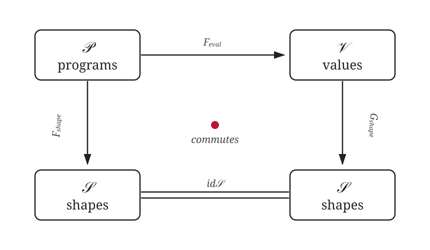
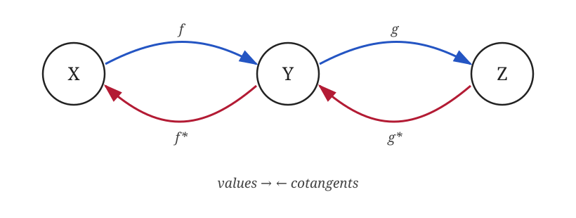
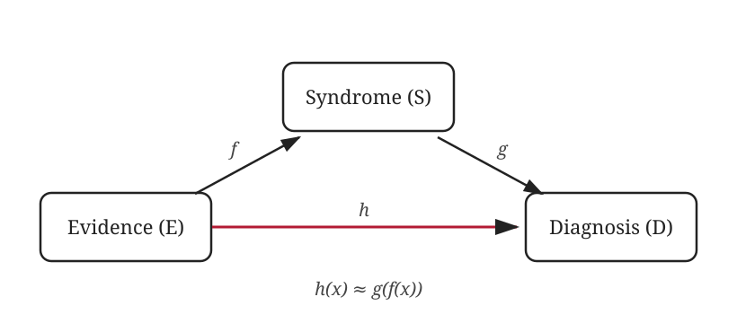

> Every commutative diagram in Deep Learning eventually commutes into heat.

An ML framework rarely gets to stop at running a model. The same model must reveal its output shapes, count its parameters, produce gradients, and eventually survive compilation and optimization. If each feature grows its own representation of the program, the framework gradually acquires a small civilization's worth of machinery.

I built [CatML](https://github.com/MasterSkepticista/catml) to study a design used by frameworks like [JAX](https://docs.jax.dev/en/latest/jaxpr.html): turn a Python function into a program representation first, then evaluate or transform that program in different ways. JAX traces functions into `jaxpr` and builds transformations such as `grad`, `vmap`, and `jit` around this separation. CatML is a smol transparent exploration of the same architectural idea through a category-theoretic lens—not a claim that tracing or composable program transformations are new.

A traced program is syntax. Evaluation, shape propagation, and differentiation are semantics. The useful bit is not the vocabulary; it is that every new analysis gets to reuse the same program.

## Model becomes data

Consider a tiny MLP:

```python
rng = np.random.default_rng(0)

def model(x):
  h = linear(x, 4, rng, tag="lin1")
  h = relu(h)
  y = linear(h, 1, rng, tag="lin2")
  return sigmoid(y)

x0 = np.zeros((2,))
program = trace_function(model, x0)
```

`trace_function` runs the Python function once, replacing arrays with tracers. Each primitive call records an instruction instead of performing numerical work. The result is a tiny SSA-like program^[SSA stands for Static Single Assignment: every variable is assigned exactly once. This makes dependencies explicit without requiring a separate graph object.]:

```text
Program(
  inputs: v0
  instructions:
    0: v1 = linear(v0) params=W=(4, 2), b=(4,) tag=lin1
    1: v2 = relu(v1)
    2: v3 = linear(v2) params=W=(1, 4), b=(1,) tag=lin2
    3: v4 = sigmoid(v3)
  outputs: v4
)
```

The model is now ordinary data: a list of instructions with explicit inputs, outputs, parameters, and tags. Forward execution is a walk from top to bottom. Backpropagation is the same walk in reverse. Formatting it does not require spelunking through Python objects.

The tracing hook itself is small:

```python
def bind(prim, *args, params=None, tag=None):
  params = params or {}
  trace = current_trace()
  if trace is None:
    return prim.eval(args, params)
  return trace.bind(prim, args, params, tag)
```

Outside a trace, a primitive evaluates eagerly. Inside one, it records an instruction.

## Interpreters as Functors

First, a tiny bit of category theory. A **category** contains objects and arrows between them, together with a rule for composing compatible arrows. Think of data types as objects and functions as arrows: if $f$ takes us from $X$ to $Y$, and $g$ from $Y$ to $Z$, we can wire them together as $g \circ f$.

A **functor** is a structure-preserving translation from one category to another. It translates objects and arrows, but does not change how they connect. Translating a composed pair of arrows must give the same result as translating each arrow first and then composing them:

$$
F(g \circ f) = F(g) \circ F(f)
$$

Now suppose traced programs form a category $\mathcal{P}$: model input and output spaces are objects, programs are arrows, and wiring programs together is composition. An interpreter acts like a functor by translating each program into a particular semantic world without disturbing that wiring.

CatML has a numerical interpreter $F_{\text{eval}}$, a shape interpreter $F_{\text{shape}}$, and a parameter-counting fold over the same instruction list.

Functors describe individual translations. **Naturality** describes when translations agree with the structure around them. Its visual test is a commuting diagram: if two paths begin and end at the same places, following either path must produce the same result. Naturality is therefore a consistency condition—changing viewpoints before applying a program should agree with changing viewpoints afterwards.

> Trace once, interpret many times.

<figure style="text-align: center;">
  
  <figcaption>The shape naturality square. Commutativity means both routes from $\mathcal{P}$ to $\mathcal{S}$ agree.</figcaption>
</figure>

In this square, $\mathcal{P}$ is the category of traced programs, $\mathcal{V}$ contains concrete array values, and $\mathcal{S}$ contains shapes. $F_{\text{eval}}$ evaluates a program, $F_{\text{shape}}$ interprets it using only shapes, and $G_{\text{shape}}$ forgets an array's values while retaining its shape.

Naturality says that evaluating a program and then forgetting everything except its output shape must agree with propagating the input shape through the program directly:

$$
\operatorname{shape}(\operatorname{eval}(p, x))
=
\operatorname{shape\_program}(p, \operatorname{shape}(x))
$$

The corresponding naturality check in code is:

```python
y = eval_program(program, (x0,))
y_shape = shape_program(program, (x0.shape,))

assert y.shape == y_shape
```

This agreement is what makes abstract shape evaluation useful for early errors, memory planning, or a compiler optimization pass. We can reason about the program without allocating its tensors.

## Primitives explain themselves

The interpreters remain small because each primitive carries its local meaning together:

```python
@dataclass(frozen=True)
class Primitive:
  name: str
  eval_fn: EvalFn
  pullback_fn: PullbackFn
  shape_fn: ShapeFn
  param_count_fn: ParamCountFn
```

A `linear` primitive knows how to multiply arrays, infer its output shape, count `W` and `b`, and pull an output gradient back to its input and parameters. Adding an operation means teaching that operation these rules once—not updating a collection of unrelated subsystems.

## Autodiff is the same program, backwards

**Values**, also called primals, are the ordinary arrays computed during the forward pass: activations enter an operation and new activations come out. A **cotangent** is the reverse-pass sensitivity attached to a value. For an array, it has the same shape and records how changing each component would affect the final objective.

When the backward pass crosses a function, its pullback converts the output cotangent into cotangents for the function's inputs. Thus, for a composition $X \xrightarrow{f} Y \xrightarrow{g} Z$, values travel to the right while cotangents travel to the left:

$$
(g \circ f)^* = f^* \circ g^*
$$

<figure style="text-align: center;">
  
  <figcaption>Reverse-mode autodiff reverses the order of composition.</figcaption>
</figure>

The IR already contains the dependency order, so it doubles as the autodiff tape. CatML first evaluates the instructions and caches their local inputs and outputs. It then walks those contexts backwards:

```python
for instr, inputs, output, input_ids in reversed(contexts):
  input_grads, param_grads = instr.prim.pullback(
    inputs, instr.params, grad_env[instr.outputs[0].ident], output
  )
```

Gradients meeting at the same SSA variable are added together. Tagged instructions also collect parameter gradients by layer. There is no second graph language hiding beneath the first one.

## Making compositionality a training objective

An ordinary supervised loss compares one model output with one target. But some desired properties belong to the relationship between models. If a direct map $h$ is intended to mean the same thing as applying $f$ and then $g$, compositionality asks for

$$
h \approx g \circ f
$$

This is difficult to express cleanly when models are only Python callables embedded inside a training loop. CatML's small diagram language instead treats a traced program as a named map between representation spaces. A loss can therefore talk about complete paths of programs, not just the output of one program.

For a concrete [diagrammatic backpropagation](https://people.cs.umass.edu/~mahadeva/papers/catagi.pdf) example, consider three learned maps:

$$
f: E \to S, \qquad g: S \to D, \qquad h: E \to D
$$

Here $E$, $S$, and $D$ stand for evidence, syndrome, and diagnosis. There are two routes from evidence to diagnosis: predict it directly with $h$, or first infer a syndrome with $f$ and then diagnose it with $g$.

<figure style="text-align: center;">
  
  <figcaption>Compositionality requires the direct and composed paths to agree.</figcaption>
</figure>

The triangle is simply a picture of those two paths sharing the same start and end. We turn compositionality into something trainable by penalizing their disagreement:

$$
\mathcal{L}_{\triangle}(x)
= \frac{1}{2}\left\|h(x) - (g \circ f)(x)\right\|^2
$$

Alongside ordinary task supervision, minimizing this loss pushes the direct model and the composition to implement compatible transformations. The residual travels backwards through $h$; its negation travels through $g$, then through $f$. Every map participating in either path receives a gradient.

Because the paths are represented explicitly, the API stays close to the mathematical statement:

```python
loss, h_grads, f_grads, g_grads = triangle_gradients(
  direct=h_map,
  left=f_map,
  right=g_map,
  x=sample.evidence,
)
```

This is the useful shift in the language: the loss is designed as a relationship between program compositions, while the existing pullback machinery derives the parameter updates. The autodiff core does not need special knowledge about evidence, diagnoses, or compositionality itself.

## One program, many meanings

Category theory does not give a new tracing mechanism or autodiff algorithm, it provides a language for understanding how these pieces relate.

A model is a morphism that can be composed with other models. An interpreter is a functor that gives the model a particular meaning. Naturality checks that those two meanings remain consistent. Pullbacks explain why gradients reverse composition. Commuting diagrams are an example on how to turn agreement between composed models into something we can optimize as an objective.

Once a traced program exists as data, evaluation, shape propagation, differentiation, and compositional training become different views of the same object. CatML makes those relationships visible.

---

*Disclosure: Portions of this project were built with Codex 5.5 and subsequently reviewed, fact-checked, and edited by the author.*