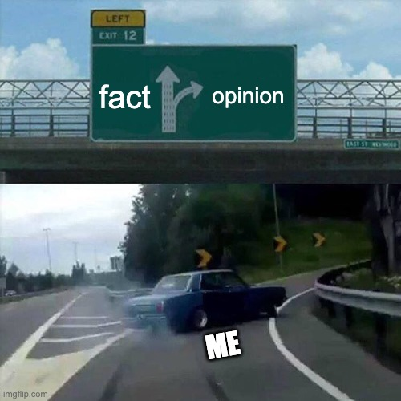

<figure>
  
</figure>

Most "preferences" we defend aren't real preferences. They're conclusions we jumped to before we actually tried something. This creates a few traps:

* **Unfamiliarity feels like dislike.** We assume we won't enjoy something just because we haven't experienced it.
* **Speed masquerades as judgment.** Quick opinions feel like wisdom, but they're just shortcuts.
* **Stories replace experience.** We build narratives ("I'm not a X person") instead of actually testing things out.

Why do we fall for this?

## Efficiency

Opinions feel efficient because they short uncertainty. They reduce cognitive load and create an illusion of clarity.

A distinction has to be made about opinions that are 'refined' through experience: that is judgment. Judgment is expensive. It is earned through contact with reality: trial, error, and revision.

Opinions let us move fast.

## Lost futures

The cost of forming opinions before exposure, is in missed optionality.

- You sample less from reality, which means you get fewer chances to discover fit, leverage, or upside.
- You miss second-order benefits from paths you never entered.
- You spend energy defending identities you did not earn.

We do not pause-and-reflect because opinion is socially cheaper than exploration.

## Imagination

Social settings reward immediacy. Silence reads as ignorance, and hesitation reads as weakness. So we opine early. We overestimate the cost it takes to actually gather reasonable amount of information or exposure to a thing. Some may find themselves filling those experience gaps with identity narratives: “I don’t do X”, “I prefer Y”. 

In practice, it takes far less effort to learn 'just enough' about what is being asked of, and then build an opinion on it, or, to empathize with contrasting viewpoints of your peers about something.

We overestimate the cost of exposure, and underestimate the cost of guessing.

## Experience, instead.

Many problems feel complex only from a distance. Once we engage with reality, simple constraints and real trade-offs are revealed. None of which are visible from imagination alone. Exposure builds experience; and experience invalidates shaky beliefs.

The takeaway (I think) is to have opinions, but treat them as debt. If you haven’t paid for one with exposure, curiosity, or effort; don’t carry it forward.

Default to gathering experience. Let judgment come later.

<blockquote class="twitter-tweet"></blockquote>
