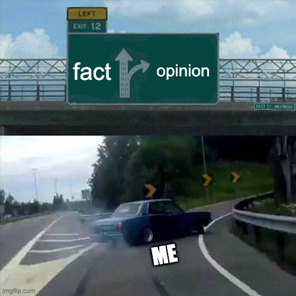

<figure>
  
</figure>

It is easy to decide that we do not like something before spending much time with it. A place, a subject, a kind of work, a person. Sometimes the judgment is right. Other times, we have simply had too little experience to know.

This happens with small things too. Someone says they are not a morning person, do not like a certain kind of food, or would never live somewhere. After saying it enough times, the opinion starts to feel settled. There is little reason to test it again.

The problem is that an early opinion can affect what happens next. If I already think I will dislike something, I am less likely to try it. If I do try it, I may give it less time. The opinion gets fewer chances to be wrong.

There is also some pressure to have an answer. In a conversation, saying “I don’t know enough about this” can feel less satisfying than having a position. So we work with whatever information is available and fill in the rest.

Most of the time, getting a little more information is not very difficult. Try something once, read about it, or talk to someone who sees it differently to see if the picture changes quickly. Even when it does not change the conclusion, there is now something behind it.

I have started thinking about this when I catch myself saying things like “I’m not into that” or “that isn’t for me.” How much of that comes from experience? How much comes from a few examples, or from an impression I formed a long time ago?

There are plenty of opinions that do not deserve this much attention. But for choices that affect what I try, where I go, what I work on, or who I spend time with, it seems useful to check.

Perhaps the distinction worth keeping is between opinion and judgment. Judgment has been paid for. It has survived some contact with reality.

So maybe opinions are best treated as a kind of debt: easy to acquire, but worth carrying only if we eventually pay for them with curiosity and experience.

Until then, sample more from reality.

<blockquote class="twitter-tweet"></blockquote>
