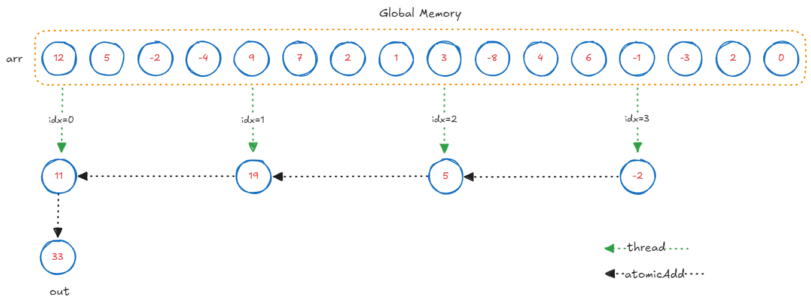
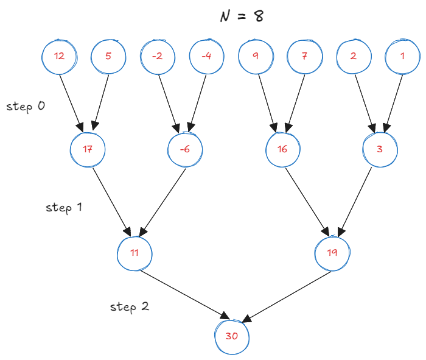
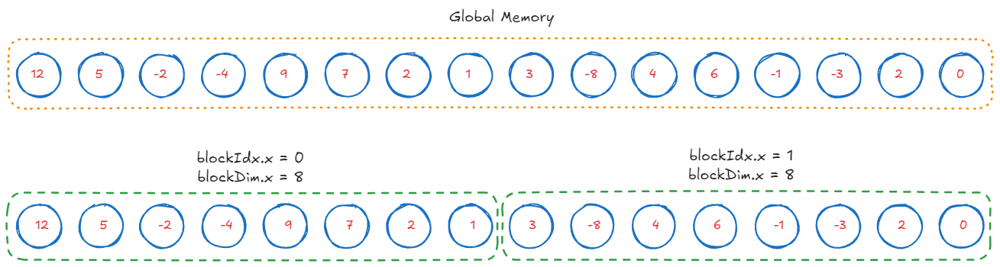
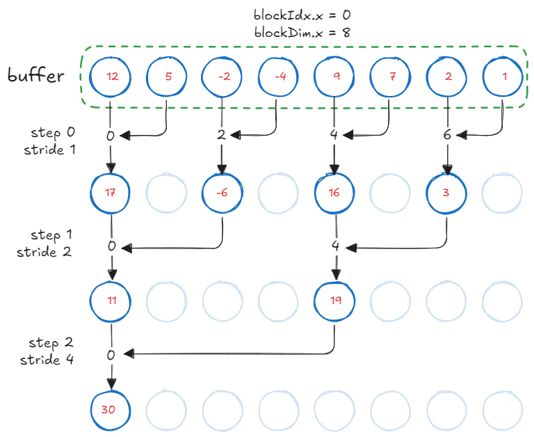
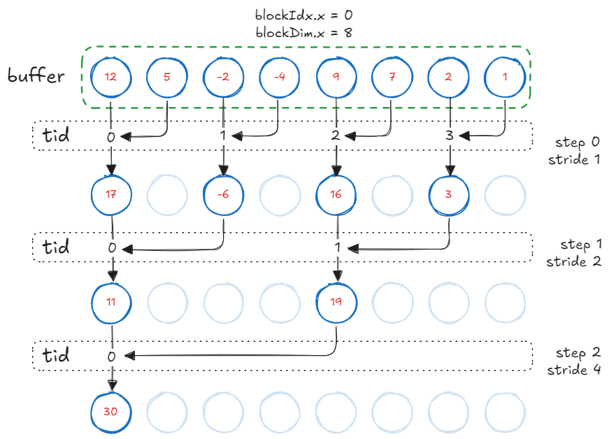
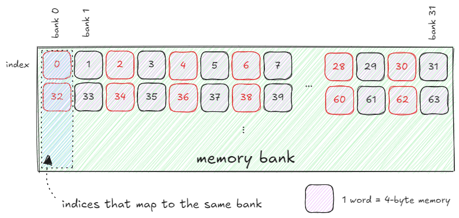
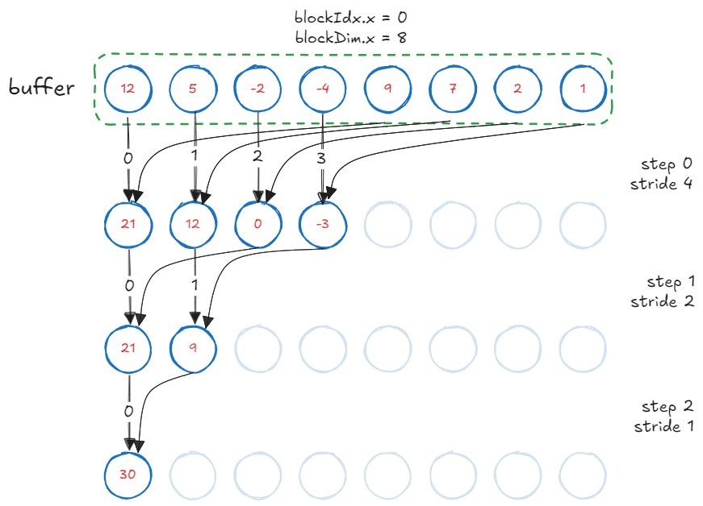
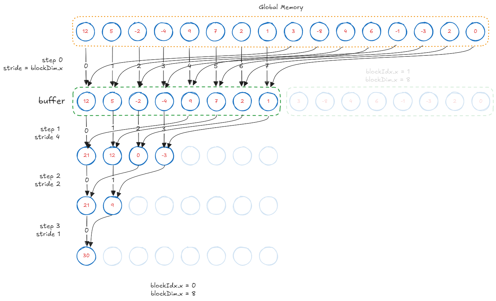

Reduce operations are common in HPC applications. They combine array elements into a single value via `sum`, `min`, `max`, `product`, etc. Reduce operations are embarrassingly parallel^[Associativity: $(a + b) + c = a + (b + c)$ means grouping does not affect the result, so partial sums can be computed independently.], which makes them a great candidate to be run on GPUs. This post will walk through a series of optimizations^[See [Optimizing Parallel Reduction in CUDA (M. Harris)](https://developer.download.nvidia.com/assets/cuda/files/reduction.pdf).] to iteratively obtain maximum device throughput.

Code is available on [GitHub](https://github.com/MasterSkepticista/parallel_reductions_cuda).

| Sr. no. | Kernel | Bandwidth (GB/s) | Relative to `jnp.sum` |
|---------|--------|------------------|----------------------|
| 1 | Vector Loads | 9.9 | 1.1% |
| 2 | Tree Reduction | 223 | 24.7% |
| 3 | Non-divergent Threads | 317 | 36.3% |
| 4 | Sequential Addressing | 331 | 38.0% |
| 5 | Reduce on First Load | 618 | 70.9% |
| 6 | Warp Unrolling | 859 | 98.6% |
| 0 | `jnp.sum` reference | 871 | 100% |


## Roofline Model

We first calculate the ridge point $\gamma$ of our RTX3090 GPU^[See [NVIDIA Ampere Architecture Datasheet](https://www.nvidia.com/content/PDF/nvidia-ampere-ga-102-gpu-architecture-whitepaper-v2.1.pdf)] (i.e., minimum floating point operations that must be carried out on each byte of data, to hit peak FLOP/s a machine is capable of) as the ratio between compute and memory bandwidth. This ridge point is an upper bound. Higher the cache reuse of a given kernel, the lower the effective ridge point.

$$
\gamma = \frac{\text{compute BW}}{\text{memory BW}} = \frac{35600}{936} = 38 \text{ FLOPs/byte}
$$

Our bench problem is to compute the sum of elements of a vector with `N` single precision floats. A reduce operation reads each element of the array at least once; about $4\cdot N$ bytes transferred, while performing $N-1 \approx N$ adds (or multiply/min/max depending on the type of reduction). Arithmetic intensity, $\alpha$, is defined as:

$$
\alpha = \frac{\text{ops}}{\text{byte}} = \frac{N-1}{4 \cdot N} \approx 0.25 \text{ FLOPs/byte}
$$

Arithmetic intensity $\alpha \lt\lt \gamma$: it is severely memory bound. We can estimate the runtime based on peak compute and memory throughput values:

* $N$ single precision reads at 936 GB/s = 0.136 ms
* $N$ single precision adds at 35.6 TFLOPS = 0.0036 ms

The theoretical minimum time for this operation is 0.136 + 0.0036 = 0.1396 ms. Since CUDA does not provide a built-in `reduce_sum` primitive, we will use `jax.numpy.sum` as a reference. `jnp.sum` completes in 0.15 ms, achieving **871 GB/s** effective bandwidth.

## Complexity Analysis

[Brent's theorem](https://stanford.edu/~rezab/dao/notes/lecture01/cme323_lec1.pdf) is how we compare efficiency across different parallel algorithms. For a parallel algorithm, we can calculate:

* $W$: work, the total number of operations if run serially.
* $S$: step complexity, or the serialization cost when certain operations cannot be parallelized.
* $P$: number of parallel processors.

Given this, time complexity with $P$ parallel processors is defined as:

$$
    T_p \le \frac{W}{P} + S
$$

We can derive a couple of interesting bounds which will be helpful later:

* $T_\infty = S$: Infinite parallelism boils down to the time taken in sequential operations.
* $T_1 = W$: Single processor time is when the total work is performed sequentially.
* $T_1 / T_p$: Speedup when using $P$ processors.
* $W / S$: Parallelism achievable in the algorithm.

For the `reduce_sum` operation, work complexity $W = N_{reads} + (N-1)_{adds}$ is $O(N)$.

## Baseline

Jensen would hate me for using GPUs to sum $N$ elements using atomic operations. But this "serial" operation serves as a baseline for all parallelism we will achieve later.

```cpp
__global__ void reduce_sum_kernel1(float *out, const float *arr, int N) {
  int idx = blockIdx.x * blockDim.x + threadIdx.x;

  if (idx < N) {
    atomicAdd(out, arr[idx]);
  }
}
```

This kernel achieves 2.47 GB/s effective bandwidth.

## Kernel 1: Vector Loads

We will start with a naive optimization. We let each thread compute a portion of the array sum in parallel, and accumulate the partial sums to the output. Since our GPU supports 128-byte load/stores, we will use the `float4` vector data type.



```c
__global__ void reduce_sum_kernel1(float *out, const float4 *arr, int N) {
  int idx = blockIdx.x * blockDim.x + threadIdx.x;

  if (idx < N) {
    float4 val = arr[idx];
    atomicAdd(out, val.x + val.y + val.z + val.w);
  }
}
```

Technically, this kernel could even saturate the memory bus using $k$-wide vector loads and $k$ sums per thread. We achieve 9.9 GB/s effective bandwidth with $k=4$: a $4\times$ throughput.

Let's not be fooled here. This is actually not a parallel algorithm.

Complexity analysis:

* Work complexity $W$ of this kernel is $O(N)$ - all elements of the array are accessed and summed once. This is the minimum work required even for a serial algorithm. Therefore, this kernel is **work efficient**.

* Step complexity $S$ for this kernel is $O(N/4) \approx O(N)$ - as all $N/4$ threads must wait for the `atomicAdd` to complete. This kernel is **not** step efficient.

* Parallelism ratio $\frac{W}{S} = \frac{O(N)}{O(N)} = 1$. This means the kernel does not scale with processors. In other words: even if we had infinite processors with infinite memory bandwidth, this kernel behaves serially under `atomicAdd` operations.

An algorithm is parallelizable if $\frac{W}{S} > 1$. Can we compute sum in less than $N$ steps?

## Kernel 2: Tree Reduction

The problem with the previous kernel is that it was not step efficient. It takes $O(N)$ steps to sum over the array. Using a binary tree reduction, we can sum the array in $\log N$ steps. Note that we still do $N-1$ adds and $N$ reads. Therefore this approach remains work efficient.



In CUDA, threads are grouped as "blocks". We will divide the array into blocks of certain size, which is a tunable parameter. Each block will sum its elements in parallel, and then the partial sums will be accumulated using atomics. For simplicity, I will depict the reduction process for a `block_size` of 8.



We load subarrays of size `block_size` into shared memory. We will use this buffer to store the partial sums.

```cpp
// a buffer that can hold 8 floats
extern __shared__ float buffer[];

/**
 * blockDim.x = 8, number of threads per block
 * blockIdx.x = 0 or 1, id of the block
 * threadIdx.x = 0...7, id of the thread within the block
 */
int idx = blockIdx.x * blockDim.x + threadIdx.x;

// thread idx within the block, 0...7
int tid = threadIdx.x;

// Load a tile
buffer[tid] = arr[idx];

// Don't proceed until all threads have loaded their values
__syncthreads();
```



We perform the reduction once the buffer is populated. GPU invokes all blocks in parallel. Each block performs a tree reduction on the buffer. The process is as follows:

1. At the first step, consecutive elements are summed by `tid=[0, 2, 4, 6]`.
2. At the second step, every second element gets summed by every second thread `tid=[0, 4]`.
3. This process continues until the final sum is stored in `buffer[0]`.

After $\log N$ reductions, each block performs an `atomicAdd` to the output. Note that this kernel **always** performs as many `atomicAdd` operations as there are number of blocks executing in parallel. Unlike our vector-load kernel, the number of atomic operations here is not dependent on the array size.


```cpp
__global__ void reduce_sum_kernel2(float *out, const float *arr, int N) {
  extern __shared__ float buffer[];
  int idx = blockIdx.x * blockDim.x + threadIdx.x;
  int tid = threadIdx.x;

  if (idx < N) {
    buffer[tid] = arr[idx];
    __syncthreads();

    for (int s = 1; s < blockDim.x; s *= 2) {
      if (tid % (2 * s) == 0) {
        buffer[tid] += buffer[tid + s];
      }
      __syncthreads();
    }

    if (tid == 0) {
      atomicAdd(out, buffer[0]);
    }
  }
}
```

This kernel achieves **223 GB/s** effective bandwidth, a $23\times$ improvement.

Complexity analysis:

* Work complexity $W$ of this kernel is $O(N)$. Therefore, this kernel is **work efficient**.
* Step complexity $S$ for this kernel is $O(\log N)$. Therefore, this kernel is **step efficient**.
* Parallelism ratio $\frac{W}{S} = \frac{O(N)}{O(\log N)} = O(N/\log N)$ is greater than 1. This is our first truly parallel algorithm.

## Kernel 3: Non-divergent Threads

Now that we have an algorithm that is both work and step efficient, all further improvements will be a result of specializing memory and computation patterns for the actual hardware.

The previous kernel suffers from two issues:

1. **Warp divergence:** Odd numbered threads remain unused. On CUDA devices, threads within a block are organized in groups of `32`, called warps. When threads of a warp "branch", the warp is said to be divergent. Compiler serializes these branches.
    
2. **Modulo arithmetic:** At each step, half the active threads enter the `if` block, perform expensive arithmetic while not participating in the computation.
```cpp
// Only evenly strided threads are active, plus % is wasteful.
if (tid % (2 * s) == 0) {
    buffer[tid] += buffer[tid + s];
}
```

We eliminate `%` operation and compute an `index` such that only consecutive threads in a block are active.
The inner loop now becomes:

```cpp
int index = 2 * s * tid;
if (index < blockDim.x) {
    buffer[index] += buffer[index + s];
}
```

{style="width: 480px; display: block; margin: 0 auto;"}

With this change, our kernel achieves **317 GB/s** effective bandwidth, a **42%** improvement over the previous kernel.

---
### Bank Conflicts^[[This repository](https://github.com/Kobzol/hardware-effects-gpu/tree/master/bank-conflicts) demonstrates these hardware effects clearly.]

On CUDA devices, shared memory is divided into groups of `32` banks, assuming each index holds `4`-byte wide memory (called a `word`). Bank ID relates to the index of memory being accessed as follows:

$$
  \text{bank} = \text{index } \% \text{ 32}
$$

If different threads access different banks in parallel, shared memory can serve all those requests with no penalty. However, if two threads access indices from the same bank at the same time, the memory controller serializes these requests. These are called bank conflicts. Below is an example of a two-way bank conflict when different threads wrap around the same bank index: `buffer[threadIdx.x * 2]`



For instance, with our non-divergent threads kernel:
* At stride `s=1`, `tid=[0,16]` access `index=[0,32]` and `index[1,33]` which belong to the same bank.
* At stride `s=2`, `tid=[0,8]` access `index=[0,32]` and `index[2,34]` which belong to the same bank.
and so on.

In summary, when different threads start accessing addresses that wrap around the bank index (due to modulo 32 behavior), it may lead to 2-way, 4-way, or even higher-degree conflicts. We will see how to eliminate bank conflicts in the next kernel.

## Kernel 4: Sequential Addressing

There is one neat trick up CUDA's sleeves. It is not a bank conflict if the same thread accesses multiple addresses within the same bank. Looking at the conflict example, we want `tid=0` to access `index=[0,32]`, `tid=1` to access `index=[1,33]` and so on. To do so, we invert the stride calculation.



```cpp
// halve stride on each step
for (int s = blockDim.x / 2; s > 0; s /= 2) {

  // bounds checking
  if (tid < s) {
    buffer[tid] += buffer[tid + s];
  }
  __syncthreads();
}
```

This kernel achieves **335 GB/s** effective bandwidth. While this change might not seem as impressive in terms of speedup, sequential addressing and elimination of bank conflicts is the foundation for our next banger.

## Kernel 5: Reduce on First Load
Half the threads in each block do not perform any computation during the first reduction step. We can halve the total blocks and let each thread perform first level of reduction while loading elements in the buffer.

```cpp
buffer[tid] = arr[idx] + arr[idx + blockDim.x];
```



This kernel achieves **618 GB/s** effective bandwidth, over **1.86** $\times$ faster.

## Kernel 6: Warp Unrolling
Sequential addressing has a key feature: threads that finish execution become idle for the rest of the program. When number of active threads become less than 32, all these threads are part of the same "warp" in their respective blocks. Threads that are part of the same warp do not need thread synchronization calls or bounds checking. This reduces instruction overhead.

By unrolling the reduction for last 32 elements, we eliminate useless work in all warps of all blocks.

```cpp
// Reduce synchronously across blocks until we have 32 threads left.
for (int s = blockDim.x / 2; s > 32; s /= 2) {
  if (tid < s) {
    buffer[tid] += buffer[tid + s];
  }
  __syncthreads();
}

// Unroll and reduce for the last 32 threads.
if (tid < 32) {
  warpReduce(buffer, tid);
}
```

We define a device function to unroll the warp and perform reductions.
```cpp
__device__ void warpReduce(volatile float *buffer, int tid) {
  buffer[tid] += buffer[tid + 32];
  buffer[tid] += buffer[tid + 16];
  buffer[tid] += buffer[tid + 8];
  buffer[tid] += buffer[tid + 4];
  buffer[tid] += buffer[tid + 2];
  buffer[tid] += buffer[tid + 1];
}
```

We are now at **859 GB/s** effective bandwidth, within ~2% of `jax.numpy.sum`.

Who doesn't like speed?
