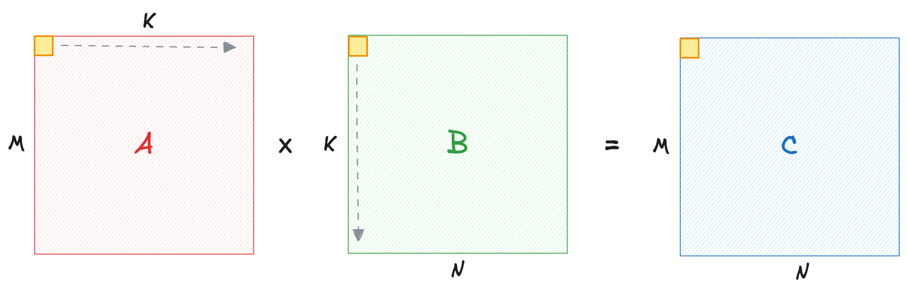
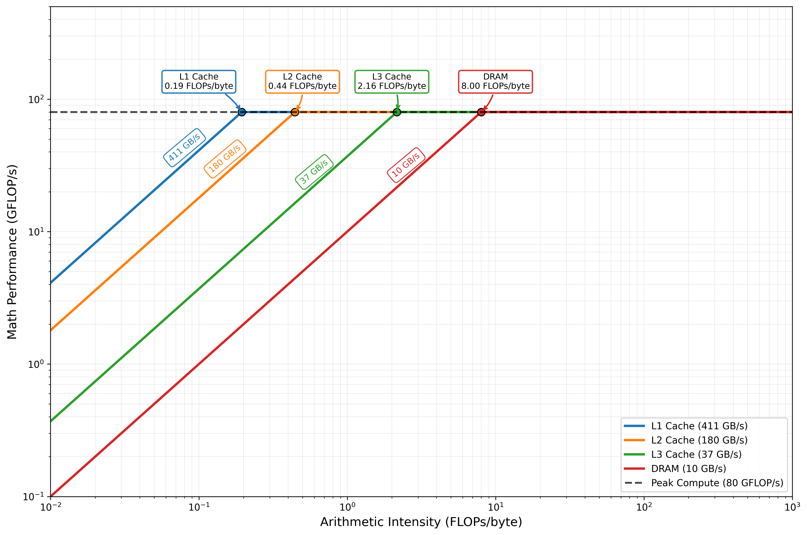
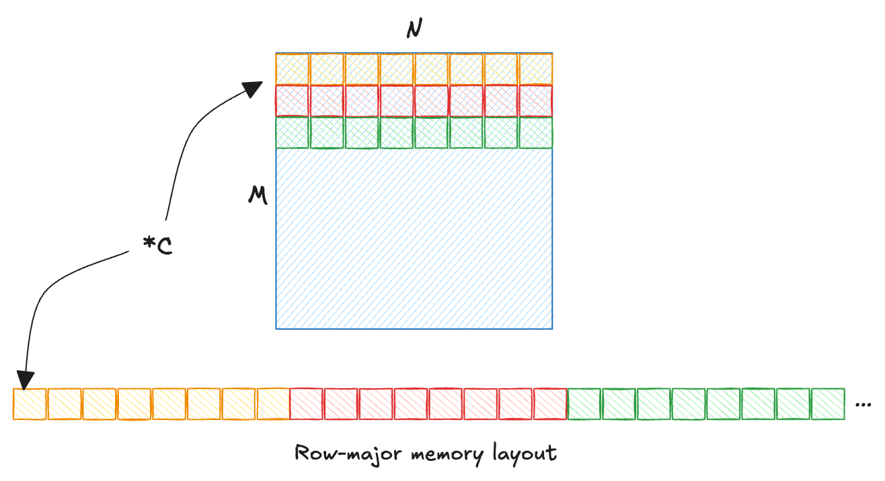
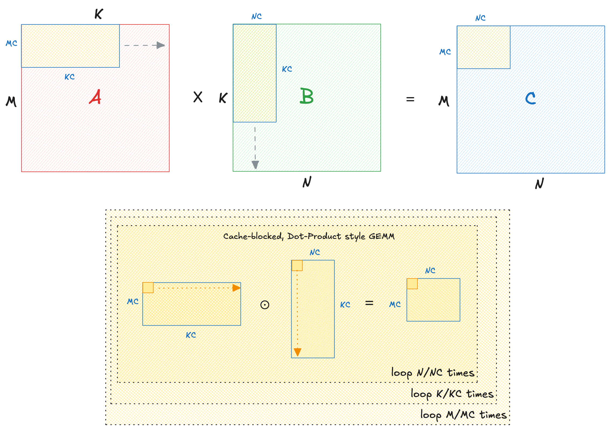
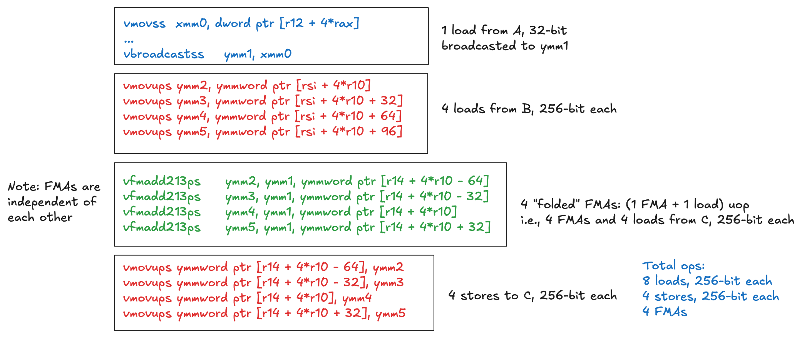
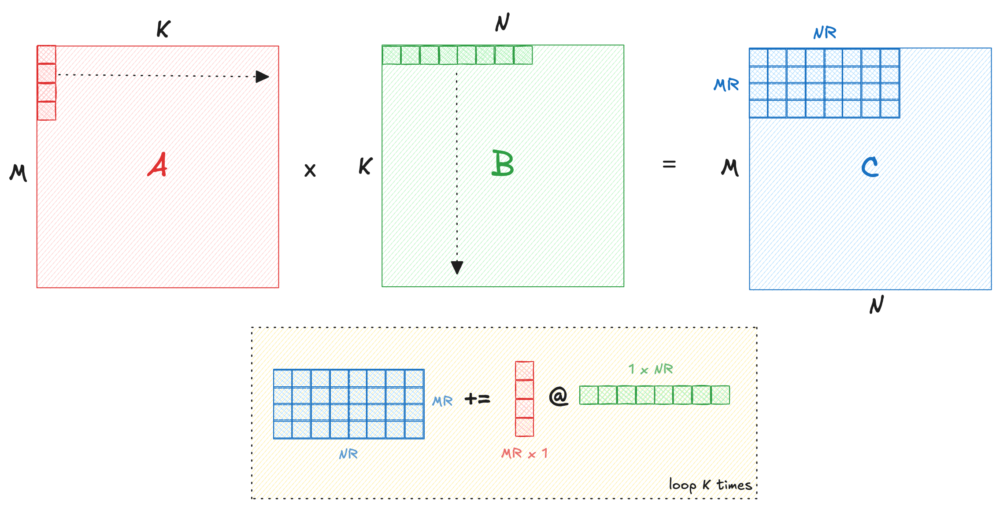
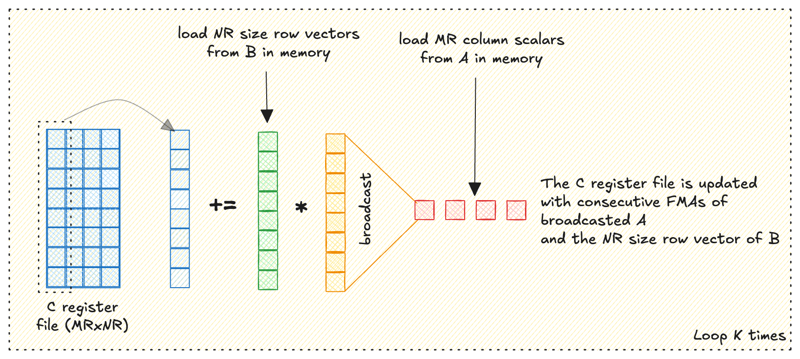

This post documents my attempt to optimize a single-precision general matrix multiplication (SGEMM) kernel in pure C, progressing from a naive implementation to near-OpenBLAS performance in single-threaded. Along the way, I connect each optimization to the CPU architecture and instruction set that make it effective. These resources were especially helpful:

* [Algorithmica: Matrix Multiplication (Sergey Slotin)](https://en.algorithmica.org/hpc/algorithms/matmul/)
* [Advanced Matrix Multiplication on Multi-Core Processors (Aman Salykova)](https://salykova.github.io/gemm-cpu)
* [Can you multiply a matrix? (George Hotz)](https://youtu.be/VgSQ1GOC86s?si=G7VmTNu3uL5b0_8u)
* [Fast Multidimensional Matrix Multiplication on CPU from Scratch (Simon Boehm)](https://siboehm.com/articles/22/Fast-MMM-on-CPU)


| Kernel | Implementation | GFLOP/s ($N$=1024) |
|--------|----------------|---------------------|
| 0 | openBLAS reference | 190 |
| 1 | Loop-reordered pointwise GEMM | 18 |
| 2 | Cache-blocked pointwise GEMM | 46 |
| 3 | AVX2 outer $6\times16$ | 53 |
| 4 | AVX2 outer $6\times16$ with cache blocking | 103 |
| 5 | AVX-512 outer $8\times48$ with cache blocking | 189 |

Code available [here](https://github.com/masterskepticista/sgemm.c).

## Introduction

Let us start by describing the pointwise operation:





```c
void gemm_naive(float *C, 
                const float *A, 
                const float *B, 
                int M, 
                int N, 
                int K) {

  for (int i = 0; i < M; i++) {
    for (int j = 0; j < N; j++) {
      for (int k = 0; k < K; k++) {
        C[i * N + j] += A[i * K + k] * B[k * N + j];
      }
    }
  }
}
```

It takes ~1.2 seconds (equivalently 1.7 GFLOP/s) for this kernel to multiply two 1000-size square matrices. This is absurdly slow for a CPU of this day and age. NumPy, in comparison, finishes this operation in 11ms, over 100x faster. Before we start optimizing this naive kernel, lets take stock of how to reason about the performance of a kernel.

## Roofline Analysis

Our testbench:

* Intel Xeon [Sapphire Rapids] 8488C @ 3.2GHz
  * Cache L1d: 48 KB/core | L2: 2 MB/core | L3: 105 MB/shared
  * ISA support: AVX-2 | AVX-512
  * Microarchitecture: Golden Cove^[[Popping the Hood on Golden Cove, by Chester Lam](https://chipsandcheese.com/p/popping-the-hood-on-golden-cove)]
* 4GB Memory, 10GB/s STREAM bandwidth (measured using `mbw`)
* Ubuntu 24.04 LTS

We will measure the performance of our GEMM kernels in GFLOP/s. GEMM involves `K` dot products across each row and column of `A` and `B` respectively to furnish each element of result matrix `C`.

$$
A^{M \times K} \times B^{K \times N} = 2 \cdot M \cdot N \cdot (K - 1) \approx 2 \cdot MNK
$$

We apply a scaling factor of 2 because we count multiply and adds as two separate ops. Assuming equal matrix dimensions, this is roughly $2N^3$ FLOPs. Each input matrix `A`, `B` of size $4 \cdot N^2$ bytes will be read once. Output matrix of size $4 \cdot N^2$ bytes will be read and written back to memory. Therefore, we are dealing with a memory traffic of at least $4 \cdot (4 \cdot N^2)$ bytes.

The ratio of floating point ops per byte of data moved is called the **arithmetic intensity** of an operation. For GEMM, arithmetic intensity $\alpha$ is:

$$
\alpha = \frac{\text{ \char"0023 operations }}{\text{ \char"0023 bytes transferred }} = \frac{2N^3}{16N^2} = \frac{N}{8} \text{ FLOPs/byte }
$$

This means that as matrix sizes grow, GEMM operation becomes compute-bound. If we know the compute and memory bandwidth of a machine, we can calculate what is called the 'ridge point' of a machine. Any compute kernel that executes *less* floating point operations per byte than the ridge point is said to be *memory-bound*, and vice versa.

Intel Golden Cove core has two 512-bit wide FMA (fused multiply-add) units that can operate on 16 floats simultaneously (the focus of the first half of this article is on 256-bit vector operations which are shared with the 512-bit wide FMAs). Each core also has 32 of these 512-bit registers (named `zmm0-zmm31`). Likewise, 16 registers are available (named `ymm0-ymm15`) when using 256-bit wide FMAs. Registers sit on top of the memory hierarchy, with a single-clock tick access. FMA units also have a latency of 4 clock cycles, and a throughput of 2 IPC^[Instructions per clock. Here it means that both FMA units can dispatch in parallel ([ref](https://chipsandcheese.com/p/a-peek-at-sapphire-rapids)). Amortized, this gives a 1FMA/cycle of throughput if scheduled properly.]. For GEMMs we care only about streaming FMA throughput. The dispatch latency becomes irrelevant after first few FMAs. 

Let us calculate the compute bandwidth when using 256-bit wide FMAs:

$$
2 \text{ ops } \times 2 \text{ IPC } \times 8 \text{ floats/cycle } \times 3.2 \text{ GHz } = 102.4 \text{ GFLOP/s }
$$

All else same, 512-bit wide FMAs double the throughput by processing 16 floats/cycle, i.e., $204.8 \text{ GFLOP/s }$. This is what openBLAS can achieve at small cache-friendly matrix sizes, and will be our peak.

The DRAM bandwidth on our setup is 10GB/s per thread from a simple `mbw` benchmark. Therefore, the ridge point $\gamma$ of this CPU across DRAM is:

$$
\gamma = \frac{\text{compute BW}}{\text{memory BW}} = 8 \text{ FLOPs/byte }
$$




In practice, the ridge point depends on cache reuse, branching, instruction mix, and tiling overheads. For instance, if we manage to keep the entire working set of a GEMM operation within cache boundary (which we will see soon with a cache-blocked GEMM kernel), the arithmetic intensity necessary to saturate compute units is lower. If the arithmetic intensity of kernel lands to the right of a ridge point, it is said to be *compute-bound* on that memory ladder. Likewise, if a compute kernel lands in the triangle below the ridge point, it is said to be *memory-bound* on that memory ladder. 

## Memory Layout
As mentioned earlier, our arrays store floats in a row-major order, i.e., elements of a row are laid out consecutively. CPUs fetch contiguous blocks of memory (called a cache line) in the hope that consecutive memory elements will be needed for further processing. If a computation does not utilize all items in a cache line optimally, CPU cycles are wasted. BLAS libraries often choose a column-major layout. This choice is arbitrary in the extent we reach fairly close to the hardware limit.




Revisiting the naive kernel above, we can deduce a couple of observations:

* Innermost loop iterates the fastest, over dimension `K`. 
* Array `A[M * K]` has `K` columns, with each element `A[i][k]` consecutively laid out in memory. Therefore, iteration over `K` is cache-friendly.
* Array `B[K * N]` has `K` rows, each element `B[k][j]` requires jumping an entire row of `N` elements in memory. This results in a poor cache utilization.
* Array `C[M * N]` has `j` as the fastest moving dimension, i.e., the second loop. It is consecutively laid out in memory, and is cache-friendly.

## Spatial Locality

Iterating over rows of `B` is the problem. Notice that the nested for-loops are order-independent, and array `C` does not depend on dimension `K`. Therefore, we can reorder the loops such that iterating over `K` dimension is slower, and hence less costly for `B`.

```c
/** Basic loop-reordered, pointwise GEMM kernel. */
void gemm_loop_reorder(float* __restrict C, 
                        const float* __restrict A, 
                        const float* __restrict B, 
                        int M, 
                        int N, 
                        int K) {

  for (int i = 0; i < M; i++) {
    for (int k = 0; k < K; k++) {
      for (int j = 0; j < N; j++) {
        C[i * N + j] += A[i * K + k] * B[k * N + j];
      }
    }
  }
}
```
By swapping `j <-> k`, we retain cache-friendliness of `A` and `C`, while reusing the element `B[k][j]` for `N` iterations before incurring a cache miss. We still incur the same number of misses. We are simply amortizing the cost of each cache-miss by reusing the fetched element as long as possible.


On small matrices, this simple tweak boosts our GFLOP/s by 10-25x, saturating lower as matrices grow large. What explains this jump?

### Implicit Vectorization
Even though our loop-reordered kernel defines scalar operations, improved spatial locality on `B` allows the compiler to fuse scalar operations into vector FMA instructions. We can see this in the [disassembly](https://godbolt.org/z/5aaeYMh67) of the kernel. The compiler defaults to 256-bit vectorization.

```asm
.LBB0_19:
    vmovups ymm2, ymmword ptr [rsi + 4*r10]
    vmovups ymm3, ymmword ptr [rsi + 4*r10 + 32]
    vmovups ymm4, ymmword ptr [rsi + 4*r10 + 64]
    vmovups ymm5, ymmword ptr [rsi + 4*r10 + 96]
    vfmadd213ps     ymm2, ymm1, ymmword ptr [r14 + 4*r10 - 64]
    vfmadd213ps     ymm3, ymm1, ymmword ptr [r14 + 4*r10 - 32]
    vfmadd213ps     ymm4, ymm1, ymmword ptr [r14 + 4*r10]
    vfmadd213ps     ymm5, ymm1, ymmword ptr [r14 + 4*r10 + 32]
    vmovups ymmword ptr [r14 + 4*r10 - 64], ymm2
    vmovups ymmword ptr [r14 + 4*r10 - 32], ymm3
    vmovups ymmword ptr [r14 + 4*r10], ymm4
    vmovups ymmword ptr [r14 + 4*r10 + 32], ymm5
```

On small matrices, this loop-reordered kernel is an order of magnitude faster because the active blocks fit within the cache. As the matrix size grows, performance plateaus until active blocks fit L3. For even larger matrices, the active blocks exceed cache boundary, and require read/writes into the main memory, making the cliff visible. Can we sustain the throughput of small kernels across all sizes?

## Cache blocking
Cache size is limited. As matrix dimensions grow, there is a possibility of older cache lines being 'evicted' to fetch elements for the next iteration. This leads to wasteful load/stores and lower arithmetic intensity for large matrix sizes. We solve this by slicing each of the three dimensions into 'tiles', and executing smaller, cache-friendly matrix multiplies on those tiles. Tile dimensions are chosen to fit the fastest changing operand tiles in L1, larger `B` operand tiles in L2/L3.




```c
/** Cache-blocking across dimensions. */
#define TILE_K 128
#define TILE_N 2048
#define TILE_M 1024

void gemm_cache_blocking(float* __restrict C, 
                          const float* __restrict A, 
                          const float* __restrict B, 
                          int M, 
                          int N, 
                          int K) {

  // Tile across each dimension
  for (int i = 0; i < M; i += TILE_M) {
    const int mc = min(TILE_M, M - i);
    for (int k = 0; k < K; k += TILE_K) {
      const int kc = min(TILE_K, K - k);
      for (int j = 0; j < N; j += TILE_N) {
        const int nc = min(TILE_N, N - j);

        // Update partials on each tile
        for (int ir = 0; ir < mc; ir++) {
          for (int p = 0; p < kc; p++) {
            for (int jc = 0; jc < nc; jc++) {
              C[(i + ir) * N + (j + jc)] += 
              A[(i + ir) * K + (k + p)] * B[(k + p) * N + (j + jc)];
            }
          }
        }
      }
    }
  }
}
```

With cache-blocking, performance becomes consistent across all matrix sizes. The disassembly of this kernel is same as before. This is expected because the same instructions now run on 'tiles' of matrices. The compiler generates instructions that hide the overhead of creating tiles behind the latency of compute. Neat! But why are we stuck way below the 102.4 GFLOP/s limit of 256-bit FMAs?


### Performance ceiling
Our kernel issues repeated FMAs and cache-blocking to sustain GFLOP/s. Recall from our roofline analysis, the performance ceiling is 102.4 GFLOP/s. To understand the reason behind saturation, we must review the disassembly:





From the Golden Cove [microarchitecture](https://cdrdv2-public.intel.com/821613/355308-Optimization-Reference-Manual-050-Changes-Doc.pdf), we find the following uOp capacities:

| Op | Capacity (per cycle) | Requirement | Cycles |
|------|---------------|---------|--------|
| Loads | $3 \times 256$ | $8 \times 256$ | $3$ |
| Stores | $2 \times 256$ | $4 \times 256$ | $2$ |
| FMAs | $2$ | $4$ | $2$ |

Loads take up to 3 cycles^[A 32-bit scalar from `A` is broadcasted to `ymm1` and reused for the entire iteration. The load cost is amortized in the rest of the FMA loop, hence ignored in calculations.]. FMAs execute as soon as the operands are ready, and hence the load ops 'mask' the 2 cycles consumed by FMAs. Stores take 2 cycles after FMAs retire. So the percentage of 'useful' multiply-add work:

$$
\frac{2 \text{ FMA}}{3 \text{ loads } + 2 \text{ stores}} = \frac{2}{5} = 0.4
$$

Our performance ceiling with this kernel is $0.4 \times 102.4 = 41 \text{ GFLOP/s}$. This is nearly the ceiling we see in practice.

To exceed this ceiling, we need to renegotiate how much useful work can be done before the operands are discarded and results are written back.  

## Outer Product

So far we have been looking at matrix multiplication as repeated dot products between **rows** of `A` and **columns** of `B`:
$$
C_{ij} = \sum_{k=1}^K A_{ik} \cdot B_{kj}
$$

Dot products are inefficient on hardware for the following reasons:

* **Frequent Load/Stores for `C`**: Tiles of `C` are read and written repeatedly. This is clear from our disassembly analysis. The useful FMA work is capped at 43%.
* **Poor Register Utilization**: Registers are the fastest to access in the memory hierarchy. Vector intrinsics on modern cores like Golden Cove have 16 vector registers (32 in AVX-512). The dot-product loop uses about 6-7 registers for temporary accumulations.
* **Arithmetic Intensity**: GEMM gets more compute intense with size. Our current implementation is load/store bound at large sizes. We need to amortize the cost of load/stores with more arithmetic work.

### Matrix-multiply as an outer product
Matrix multiply can be rewritten as a cumuluative outer-product between **columns** of `A` and **rows** of `B`:
$$
C = A \times B = \sum_{k=0}^{K-1} A_{:,k} \otimes B_{k,:}
$$

Here is an example of a vector outer product with $a^{2 \times 1} \otimes b^{1 \times 2}$:
$$
a \otimes b = 
\begin{bmatrix} 
a_0 \\ a_1
\end{bmatrix} \begin{bmatrix} 
b_0 & b_1 
\end{bmatrix} = \begin{bmatrix} 
a_0 b_0 & a_0 b_1 \\ 
a_1 b_0 & a_1 b_1 \\
\end{bmatrix}
$$

In the notation:

* $A_{:,k}$ is the $k$-th column of `A` (an $M \times 1$ vector).
* $B_{k,:}$ is the $k$-th row of `B` (a $1 \times N$ vector).

Their outer product ($\otimes$) produces an $M \times N$ matrix where each element is $A_{i,k} \cdot B_{k,j}$.
Summing these over all $k$ gives the full $C$.

This is algebraically identical to the dot-product view but shifts the focus: instead of accumulating inward along $k$ for each fixed $(i,j)$, we are broadcasting outward from each $k$, adding a full "layer" to $C$ at a time.





What this reformulation improves:

* **Register Reuse**: In the outer-product view, we can load slices of $A_{:,k}$ and $B_{k,:}$ into registers, compute their outer product, and accumulate it directly into a register-resident tile of $C$. Registers are plentiful (16 YMMs can hold 128 floats total), so we can "block" a small $\text{MR} \times \text{NR}$ tile of $C$ using multiple ZMMs.
* **Load/Store Amortization**: After several updates over $k$, we store the $\text{MR} \times \text{NR}$ tile of $C$ back to memory. This amortizes load/store costs over more FMAs.
* **Higher Arithmetic Intensity**: By accumulating multiple outer products in registers, the ratio of computations to memory accesses increases.

### Outer Product using Registers
CPUs do not have an intrinsic for vector outer product, which means we need to compute one iteratively using vector FMAs.

Consider loading $\text{MR}$ scalars from $A$ across the column, and $\text{NR}$ scalars from $B$ across the row^[You may (rightly) wonder that accesses across $A$ are not cache-friendly. In practice, we transpose a tile of `A` into a buffer, which gets passed into the outer-product microkernel. Transposed `A` is cache-friendly and reuses the same for `K` outer products. Check code for details.].


We iteratively broadcast + FMA each of the scalars from $A$ to vectors of $B$, cumulatively storing the result in an $\text{MR} \times \text{NR}$ register tile of $C$.





Here is a pseudocode of the inner loop (note that `NR` floats of `B` are loaded as 8-wide vectors in one cycle):

```mathematica
fn micro_gemm(...):
  <!-- m=MR floats of A -->
  <!-- n=NR floats of B -->
  a = {}
  b[NR] = {}
  c[MR][NR] = {}

  <!-- Load tile from C -->
  for m in MR:
    for n in NR:
      c[m][n] = load(C[m][n])

  <!-- Loop over inner dimension -->
  for p in K:
    b = load(B[:NR])

    <!-- One iteration (hot FMA loop) -->
    for m in MR:
      a = broadcast(load(A[m]))
      <!-- Outer product within registers -->
      for n in NR:
        c[m][n] = fma(a, b[n], c[m][n])
    
    A += MR
    B += NR

  <!-- Store back to C -->
  for m in MR:
    for n in NR:
      store(c[m][n], C[m][n])
```

### Optimal Tile Size
When using `YMM` vector registers, we have a limit of 16. The scalars we load from $B$ of size $\text{NR}$ must be a multiple of 8 to fit in one register. Hence $B$ vector will use $\text{NR}/8$ registers. Each scalar from $A$ uses 1 register: the scalar is broadcasted to the entire vector. The $C$ accumulator fully resides in registers, requiring $\text{MR} \times \text{NR}/8$ registers. Therefore, we need to satisfy the inequality:

$$
\text{MR} \cdot \frac{\text{NR}}{8} + \frac{\text{NR}}{8} + 1 \leq 16
$$

Since $\text{MR} \ge 1$ and $\text{NR} \ge 8$ is necessary, we have the following acceptable combinations:

| MR | NR | YMM register ct. | Loads/iter (bytes) | FLOPs/iter | FLOPs/byte |
|:-:|:-:|:-:|:-:|:-:|:-:|
| 1 | 56 | 15 | 228 | 112 | 0.491 |
| 2 | 40 | 16 | 168 | 160 | 0.952 |
| 4 | 24 | 16 | 112 | 192 | 1.714 |
| 6 | 16 | 15 | 88 | 192 | 2.182 |
| 14 | 8 | 16 | 88 | 224 | 2.545 |


Only the $6 \times 16$ and $14 \times 8$ size micro-kernels are capable of saturating the core within L3 boundary (recall from the roofline plot, $2.16 \text{ FLOPs/byte}$), so we can discard other candidates. Of the two that remain, $14 \times 8$ tile actually ends up being load bound. The [disassembly](https://godbolt.org/z/YMoEExxv8) shows a memory broadcast on every FMA; compilers tend to generate memory-source FMAs instead of separating the load and broadcast into registers. As a result, even though the total number of bytes accessed is similar, each scalar requires its own load op during the FMA. This leads to roughly 15 load instructions per iteration (14 scalar loads plus one 256-bit vector load).

By contrast, the $6 \times 16$ micro-kernel performs six scalar loads and two 256-bit vector loads, for a total of eight loads. This produces a much better balance between load throughput and FMA issue rate, allowing the kernel to approach core saturation. This explains the popular choice of $6 \times 16$ in various BLAS libraries using AVX intrinsics.


### Cache Blocking (again)

We tile across of the three dimensions of the matrices and sequentially compute GEMM on each one of them.

```c
#define MR 6
#define NR 16

#define KC 256
#define NC 2048
#define MC MR * 4

void gemm_outer_product_cache_blocking(float * __restrict C, 
                                      const float * __restrict A, 
                                      const float * __restrict B, 
                                      int M, 
                                      int N, 
                                      int K) {
  for (int j = 0; j < N; j += NC) {
    const int nc = min(NC, N - j);
    for (int p = 0; p < K; p += KC) {
      const int kc = min(KC, K - p);
      pack_tileB(blockB, &B[p * N + j], nc, kc, N);
      for (int i = 0; i < M; i += MC) {
        const int mc = min(MC, M - i);
        pack_tileA(blockA, &A[i * K + p], mc, kc, K);
        for (int jr = 0; jr < nc; jr += NR) {
          for (int ir = 0; ir < mc; ir += MR) {
            const int mr = min(MR, mc - ir);
            const int nr = min(NR, nc - jr);
            micro_gemm_6x16(&C[(i + ir) * N + (j + jr)],
                            &blockA[ir * kc],
                            &blockB[jr * kc],
                            mr, nr, kc, N);
          }
        }
      }
    }
  }
}
```

### Micro-optimizations
Cache blocking isn't enough. To match openBLAS, we also apply the following (refer code for more details):

* Prefetching `C` to cache, in-flight during FMAs:

```c
// Start fetching C into L1.
for (int i = 0; i < MR; i++) {
  _mm_prefetch(&C[i * ldC], _MM_HINT_T0);
}

// Compute.
accumulate_6x16(c, blockA, blockB, k);

// C tile ready in L1 for final update.
```
* Loop unrolling: this allows the compiler to schedule FMAs/loads/stores in a way that hides instruction latency.
* Fringe tile handling: tile dimensions that are not multiples of 6 or 16 are handled separately.


With these changes, we approach the machine limit of 256-bit wide FMAs!

## Wider Registers

We rewrite the same outer-product kernel with 512-bit intrinsics, and compute ideal values of `MR` and `NR` that saturate the FLOPs/byte. In my case, `MR=8`, `NR=48` matches openBLAS on large matrix sizes^[OpenBLAS achieves 200+ GFLOP/s throughput on small matrices (close to machine limit) because it skips the packing and issues direct GEMM on in-cache arrays. I skip this to keep the code readable.]. Same micro-optimizations carry into this kernel as well.
We started at 1.7 GFLOP/s with the same underlying computation; and rearranging it around the hardware gets us within striking distance of openBLAS.


This is the GEMM playbook: reuse data at every level of the memory hierarchy, keep the hot tile in registers, and make the FMA units the bottleneck. This is perhaps the story behind all high-performance kernels, on CPUs or XPUs: keep data close, reuse aggressively, and give the compute units enough independent work to stay busy.
